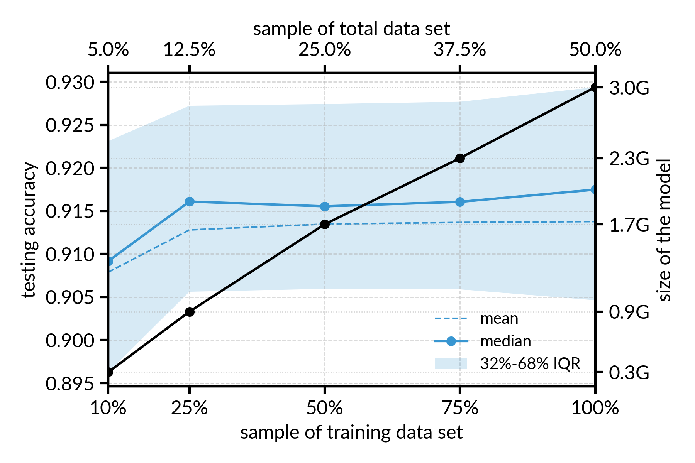

# Transfer Learning to Build a Scalable Model for the Declustering of Earthquake Catalogs

### Access the preprint *[here](https://www.essoar.org/doi/10.1002/essoar.10508001.1)*

## Summary
In this repository you will find (soon):
 - a folder containing the catalogs of Southern California and New Zealand used in our study;
 - a code ``` extract_features.py ```to identify the nearest neighbors or the ```N-1``` events in your catalog and extract the features necessary to run the Random Forest model;
 - a code that load the declustering model and applies it to the feature catalog generated previously to predict the labels in your catalog.

## The Declustering Model(s)

*We assume here that the user as read the manuscript*

The hyperparameters of the Random Forest model used in our work makes it heavier depending on the size of the training data set. Computer's RAM can vary from one computer to another and having a heavy model could limit users with limited amount of memory such as my own laptop.
As the accuracy of the model depends on the training data set (TD), we investigated the influence of the percentage of the total TD on the model accuracy with the idea to eventually propose different models to the users. To do so, we trained 5 models with a similar set of hyperparameters for 10%, 25%, 50%, 75% and 100% of the available TD (100 synthetic catalogs).
Using the testing data set (100 remaining catalogs), we estimated the testing accuracy as a function of the percentage of the TD (Figure 1).


#### *Figure 1. Influence of training data set sampling on the testing accuracy of our Random Forest declustering model.*

The result shows that whether we use 25% or 100% of the training data set to train a Random Forest model, the testing accuracy does not significantly change, only the size of the model (compressed!).

Now to obtain the results presented in our study, we trained a Random Forest model with 100% of the data set (training + testing).
To test if the sampling of the total data has an effect on the final Random Forest model, we compared the labels obtained with the model presented in our manuscript with labels obtained from models trained on 10%, 25%, 50% and 75% of the total data set (Figure 2). As labels are unkown for a real catalog, we considered the predictions of our original as the ground truth.


#### *Figure 2. Influence of total data set sampling and comparison with the original model.*

The result shows that using for example 50% of the total data set (100 catalogs) implies a 3% changes in the prediction of the original model for a difference of around 600Mb in the size of the model (compressed). Obviously, this 3% could actually improve the predictions but we do not have any mean to verify that. This result shows to the user that the predictions might be different using one model or another.

# In the next few days, we will publish links to download a pair or models trained on different proportion of the total data set. Figures will be updated with uncompressed model sizes. Stay tuned!
